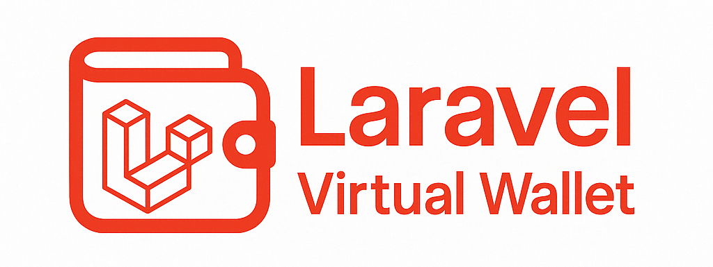

<h1 align="center">💳 Laravel Virtual Wallet Documentation</h1>

<p align="center">
    
</p>

A lightweight, plug-and-play Laravel package for managing virtual wallets, supporting multiple wallet types, transaction logs, and seamless integration with any model like `User`.

---

## 🚀 Features

💼 **Multi-Wallet Support** — Create and manage multiple wallet types per user.  
📜 **Transaction Management** — All wallet operations are recorded for full traceability.  
💳 **Payment Processing** — Seamlessly handle payments between wallets or external systems.  
🏦 **Deposit Handling** — Accept and log deposits from users or third-party services.  
🌍 **Multiple Currency Support** — Manage wallet balances in different currencies with ease.  
📶 **Wallet Status Tracking** — Monitor and update wallet statuses like active, frozen, or closed.  
🔐 **Secure & Reliable** — Built using Laravel's Eloquent, enums, morphs & policy-friendly structure.  
⚙️ **Highly Configurable** — Override models, table names, and more via config.  
🧩 **Easy Integration** — Just use a trait on your model and you're ready to go.  
💸 **Balance Management** — Simple credit, debit, transfer, and balance APIs.

---

## 📦 Installation

```bash
composer require haxneeraj/laravel-virtual-wallet
php artisan vendor:publish --provider="Vinalask3\LaravelVirtualWallet\LaravelVirtualWalletServiceProvider"
php artisan migrate
```

---

## 🔧 Configuration

After publishing the config file, you can modify `config/laravel-virtual-wallet.php` to override models, table names, and enums if needed.

---

## 📥 Setup in Your Model

Add the trait and implement the interface in your `User` (or any Eloquent model):

```php
use Vinalask3\LaravelVirtualWallet\Interfaces\WalletInterface;
use Vinalask3\LaravelVirtualWallet\Traits\HasVirtualWallet;

class User extends Authenticatable implements WalletInterface
{
    use HasVirtualWallet;
}
```

---

## 💡 Usage

### Create Wallets

```php
$user->wallets()->create([
    'wallet_type' => 'main', // Type of wallet (e.g., 'main', 'bonus', 'savings'). Define these in your WalletType enum.
    'currency' => 'usd', // ISO currency code. Ensure 'usd' or your required currencies are defined in your Currency enum.
    'balance' => 100, // Initial wallet balance. Usually set to 0 or default starting value.
    'currency_type' => 'fiat_currency', // Define whether the currency is fiat, crypto, token, etc. Set values in CurrencyType enum.
    'status' => 'active' // Current status of wallet (e.g., 'active', 'frozen', 'closed'). Defined in WalletStatus enum.
]);
```

### Deposit

```php
$paymentData = new PaymentData([
    'owner_type' => User::class,
    'owner_id' => $this->user->id,
    'txid' => 'test-txid',
    'amount' => 100,
    'description' => 'Test deposit',
    'wallet_type' => 'wallet1',
    'method' => 'automatic',
    'transaction_type' => 'deposit',
    'status' => 'approved',
    'currency' => 'usd',
    'currency_type' => 'fiat_currency'
]);
$user->deposit($paymentData);
```

### Withdraw

```php
$paymentData = new PaymentData([
    'owner_type' => User::class,
    'owner_id' => $this->user->id,
    'txid' => 'test-txid-withdraw1',
    'amount' => 50,
    'description' => 'Test withdrawal',
    'wallet_type' => 'wallet1',
    'method' => 'automatic',
    'transaction_type' => 'withdraw',
    'status' => 'approved',
    'currency' => 'usd',
    'currency_type' => 'fiat_currency'
]);
$user->pay($paymentData);
```

### Get Balance

```php
$balance = $user->getBalance('main');
```

### Check Balance

```php
$user->hasSufficientBalance(50, 'main');
```

---

### Available Methods

#### Wallet Management

| Method                   | Parameters                                       | Returns         | Description                          |
|--------------------------|--------------------------------------------------|------------------|--------------------------------------|
| `wallets()`              | `string $walletType = null`                     | `MorphMany`      | Get all wallets or filter by type    |
| `getBalance()`           | `string $walletType = null`                     | `int | float`    | Get wallet balance                   |
| `hasBalance()`           | `string $walletType = null`                     | `bool`           | Check if wallet has positive balance |
| `hasSufficientBalance()` | `int | float $amount, string $walletType = null`| `bool`           | Check if wallet has sufficient balance |

#### Payment Processing

| Method   | Parameters                 | Returns | Description                    |
|----------|----------------------------|---------|--------------------------------|
| `pay()`  | `PaymentData $paymentData` | `void`  | Process payment from wallet(s) |

#### Deposit Handling

| Method      | Parameters                 | Returns | Description               |
|-------------|----------------------------|---------|---------------------------|
| `deposit()` | `PaymentData $paymentData` | `void`  | Deposit funds into wallet |


---

## Data Objects

### PaymentData

The `PaymentData` object is used for both payments and deposits. It accepts the following parameters:

- `owner_type`: Owner model type
- `owner_id`: Owner model ID
- `amount`: The amount to process
- `wallet_type`: Type of wallet (optional)
- `description`: Transaction description
- `status`: Transaction status
- `method`: Payment method
- `transaction_type`: Type of transaction
- `txid`: Transaction ID

## Exceptions

The package throws the following exceptions:

- `InvalidWalletException`: When wallet type is invalid or wallet not found
- `InsufficientBalanceException`: When wallet balance is insufficient

---

## ⚙️ Testing

This package comes with feature and unit tests to ensure everything works smoothly.

🏃 Run Tests

```bash
composer test
```

---

## 🤝 Contributing

Contributions, issues and feature requests are welcome!

1. Fork it
2. Create your feature branch (`git checkout -b feature/awesome`)
3. Commit your changes (`git commit -am 'Add something awesome'`)
4. Push to the branch (`git push origin feature/awesome`)
5. Create a new Pull Request

---

## 🧠 Author

**Neeraj Saini**  
📧 [hax-neeraj@outlook.com](mailto:hax-neeraj@outlook.com)  
🌐 [https://github.com/haxneeraj/laravel-virtual-wallet](https://github.com/haxneeraj/laravel-virtual-wallet)

---

## 📄 License

Licensed under the [MIT License](LICENSE).
